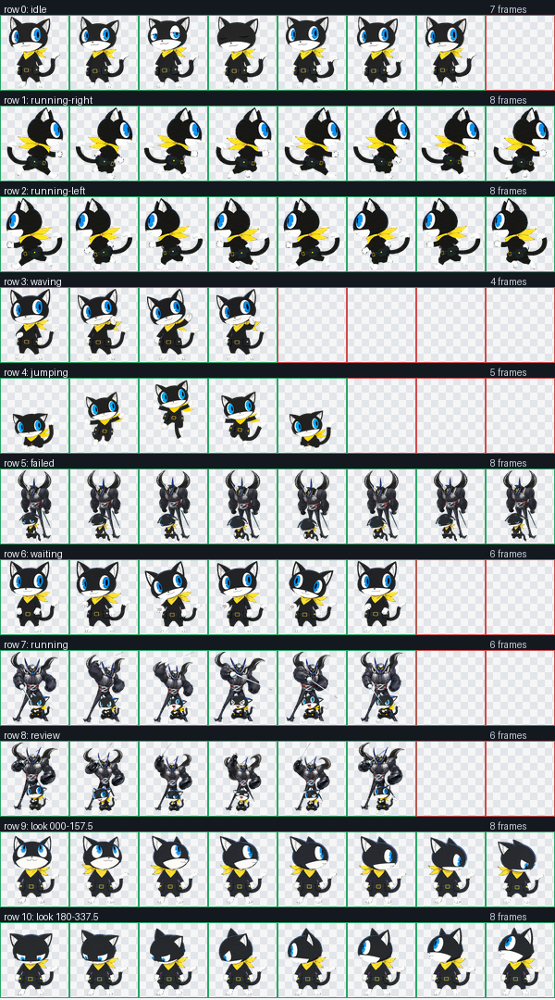

# Morgana Codex Pet 

一个以《女神异闻录 5》摩尔加纳（Morgana）和人格面具 Zorro 为主题的 Codex 桌宠。

本项目使用 Codex Pet v2 图集格式，包含完整的基础状态动画、左右移动动画，以及 16 个观察方向。工作、审查和失败状态会出现 Zorro；其余状态保持 Morgana 的桌宠形象。

> 这是非官方的粉丝创作项目，与 Atlus、SEGA 或 OpenAI 无隶属或授权关系。相关角色及商标归各自权利人所有。



## 特点

- 更自然的左右跑步循环：触地、下压、蹬地、腾空相位完整，肩胯反向运动，围巾和尾巴延迟跟随。
- 更灵动的待机动作：呼吸、眨眼、轻微耳动，以及错相的尾巴和围巾摆动。
- 更有力量感的工作状态：Zorro 完成蓄力、剑击、回弹和收势，同时保持 Morgana 在前景清晰可辨。
- 所有方向跑步帧均保留两条连接的手臂和两只可见白爪。
- 16 个观察方向，支持 Codex Pet v2 的方向响应。
- 最终图集已经过帧数、透明度、色键残留、尺寸和视觉连续性检查。

## 安装

仓库中的 `package` 目录就是可安装包。Windows PowerShell：

```powershell
$petDir = Join-Path $env:USERPROFILE ".codex\pets\morgana-zorro"
New-Item -ItemType Directory -Force -Path $petDir | Out-Null
Copy-Item -LiteralPath ".\package\pet.json" -Destination $petDir -Force
Copy-Item -LiteralPath ".\package\spritesheet.webp" -Destination $petDir -Force
```

随后在 Codex 中选择 `Morgana + Zorro`。如果 Codex 已经打开并缓存了旧图集，请切换一次桌宠或重启 Codex。

## 图集规格

| 项目 | 数值 |
| --- | --- |
| Sprite version | 2 |
| 图集尺寸 | 1536 × 2288 |
| 网格 | 8 列 × 11 行 |
| 单元格 | 192 × 208 |
| 运行时文件 | `package/spritesheet.webp` |

状态行映射：

| 行 | 状态 | 有效帧 | 用途 |
| ---: | --- | ---: | --- |
| 0 | `idle` | 6 | 待机、呼吸和眨眼 |
| 1 | `running-right` | 8 | 向右移动 |
| 2 | `running-left` | 8 | 向左移动 |
| 3 | `waving` | 4 | 挥手和吸引注意 |
| 4 | `jumping` | 5 | 跳跃 |
| 5 | `failed` | 8 | 失败、取消或阻塞反馈 |
| 6 | `waiting` | 6 | 等待确认或用户输入 |
| 7 | `running` | 6 | 正在执行任务；不是方向跑步 |
| 8 | `review` | 6 | 准备审查或展示结果 |
| 9 | `look-row-9` | 8 | 000°–157.5° 观察方向 |
| 10 | `look-row-10` | 8 | 180°–337.5° 观察方向 |

## 项目结构

```text
package/      可直接安装的 pet.json 和 spritesheet.webp
final/        标准图集、v2 扩展图集及验证结果
frames/       按状态拆分的 192×208 透明帧
decoded/      AI 生成并通过筛选的原始横向动画条
prompts/      各状态的生成提示词与返修提示词
references/   Morgana、Zorro 和布局参考图
qa/           联系表、动画预览和自动/人工 QA 记录
```

## 预览

常用动画可以在 `qa/previews` 中单独查看：

- [`idle.gif`](qa/previews/idle.gif)
- [`running-right.gif`](qa/previews/running-right.gif)
- [`running-left.gif`](qa/previews/running-left.gif)
- [`running.gif`](qa/previews/running.gif)
- [`waiting.gif`](qa/previews/waiting.gif)
- [`review.gif`](qa/previews/review.gif)

标准 9 行总览见 [`qa/contact-sheet.png`](qa/contact-sheet.png)，包含观察方向的完整 v2 总览见 [`qa/contact-sheet-extended.png`](qa/contact-sheet-extended.png)。

## 验证状态

当前发布图集通过以下检查：

- 8 × 11、1536 × 2288 的 Codex Pet v2 结构校验。
- 所有必需状态帧存在，未使用的格子保持透明。
- 无不透明洋红色键残留或透明 RGB 残留。
- 左右跑步、待机和工作循环通过独立逐帧视觉复核。
- `final/spritesheet-extended.webp`、`package/spritesheet.webp` 与本地安装包 SHA-256 一致。

详细结果位于 [`qa/run-summary.json`](qa/run-summary.json) 和 [`qa/motion-natural-power-final-qa.json`](qa/motion-natural-power-final-qa.json)。

## 修改动画

每个状态应以完整动画行为单位进行返修，不建议只替换单帧。推荐流程：

1. 更新 `prompts/rows` 或 `prompts/row-retries` 中对应状态的提示词。
2. 生成完整横向动画条并保存到 `decoded`。
3. 拆分到 `frames/<state>`，检查帧数、边缘、比例和循环连续性。
4. 重新合成标准图集与 v2 扩展图集。
5. 对最终扩展图集执行透明边缘处理、结构验证和逐帧视觉 QA。
6. 只有通过全部检查后，才更新 `package/spritesheet.webp`。
